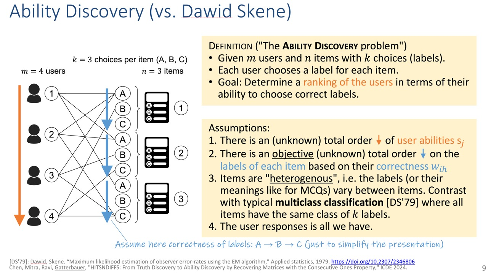

# HITSnDIFFs

[](https://doi.org/10.1109/ICDE60146.2024.00025)
[](https://arxiv.org/abs/2401.00013)
[](https://opensource.org/licenses/Apache-2.0)


This repository provides an implementation of the HITSnDIFFS approach proposed in the ICDE 2024 paper [HITSNDIFFS: From Truth Discovery to Ability Discovery by Recovering Matrices with the Consecutive Ones Property](https://doi.org/10.1109/ICDE60146.2024.00025), [(arXiv:2401.00013 full paper)](https://arxiv.org/abs/2401.00013) as well as implementations of competitors and corresponding experiments in the paper.

**ABSTRACT**: We analyze a general problem in a crowd-sourced setting where one user asks a question (also called item) and other users return answers (also called labels) for this question. Different from existing crowdsourcing work which focuses on finding the most appropriate label for the question (the “truth”), our problem is to determine a ranking of the users based on their ability to answer questions. We call this problem “ability discovery” to emphasize the connection to and duality with the more well-studied problem of “truth discovery”.

To model items and their labels in a principled way, we draw upon Item Response Theory (IRT) which is the widely accepted theory behind standardized tests such as SAT and GRE. We start from an idealized setting where the relative performance of users is consistent across items and better users choose better fitting labels for each item. We posit that a principled algorithmic solution to our more general problem should solve this ideal setting correctly and observe that the response matrices in this setting obey the Consecutive Ones Property (C1P). While C1P is well understood algorithmically with various discrete algorithms, we devise a novel variant of the HITS algorithm which we call “HITSnDIFFs” (or HnD), and prove that it can recover the ideal C1P-permutation in case it exists. Unlike fast combinatorial algorithms for finding the consecutive ones permutation (if it exists), HnD also returns an ordering when such a permutation does not exist. Thus it provides a principled heuristic for our problem that is guaranteed to return the correct answer in the ideal setting. Our experiments show that H N D produces user rankings with robustly high accuracy compared to state-of-the-art truth discovery methods. We also show that our novel variant of HITS scales better in the number of users than ABH, the only prior spectral C1P reconstruction algorithm. 

[Official paper @ IEEE (PDF)](https://doi.org/10.1109/ICDE60146.2024.00025)

[Full paper (PDF)](https://arxiv.org/abs/2401.00013) 

[Presentation slides (PDF)](https://gatterbauer.name/download/icde2024-HITSnDIFFs-Ability-Discovery-slides.pdf) 

[Video on Youtube (15min)](https://www.youtube.com/watch?v=CLLRDWEKAUQ&list=PL_72ERGKF6DQ7dKQoBZ90WVR1ndDklOH1) 

<a href="https://www.youtube.com/watch?v=CLLRDWEKAUQ&list=PL_72ERGKF6DQ7dKQoBZ90WVR1ndDklOH1"></a>

Excerpts:




Citation:

```
@inproceedings{DBLP:conf/icde/ChenM0G24,
  author       = {Zixuan Chen and Subhodeep Mitra and R. Ravi and Wolfgang Gatterbauer},
  title        = {HITSnDIFFs: From Truth Discovery to Ability Discovery by Recovering
                  Matrices with the Consecutive Ones Property},
  booktitle    = {40th {IEEE} International Conference on Data Engineering ({ICDE} 2024)}
  booktitle    = {{ICDE} 2024},
  pages        = {235--248},
  publisher    = {{IEEE}},
  year         = {2024},
  url          = {https://doi.org/10.1109/ICDE60146.2024.00025},
  doi          = {10.1109/ICDE60146.2024.00025},
}
```


## Programming Language and Libraries
The source code is written in Python, tested on Python version 3.8 or 3.10.
Install all necessary packages (numpy, scipy, matplotlib, girth, func-timeout, jupyter) by 
```
pip install -r requirements.txt
```

## Methods (`methods/`)
All the methods are in the folder, including various implementations of HITSnDIFFs (`hitsndiffs.py`) and ABH (`spectral.py`), majority vote (`majority.py`), "True-Answer" baseline (`baseline.py`), HITS-based approaches (`hits.py`) and GRM-estimator using the girth package (`grm.py`).

## Experiments (`experiments/`)
All the experiments reported in the paper in the folder, including various accuracy and efficiency experiments (`experiment.py`) on synthetic datasets (generated by `synthetic.py`), experiments on real-world datasets (`multichoice.py`), experiments on simulated datasets that use realistic estimated parameters for data generation (`simulation.py`) and experiments to compare HnD and ABH (`comparison.py`). Synthetic data and intermediate are also provided in subfolders.

## Datasets (`datasets/`)
This folder contains the six real-world datasets we used in the experiments. The datasets are originally from http://www.ml.ist.i.kyoto-u.ac.jp/en/en-research/li2017cikm and used in the CIKM paper "Hyper Questions: Unsupervised Targeting of a Few Experts in Crowdsourcing" of J. Li, Y. Baba and H. Kashima. We appreciate the sharing of the authors!

## Reproducibility
The experimental result can be reproduced by running the Jupyter notebook `figures.ipynb`. The loading indicator to be True/False indicates whether the notebook directly reads the executed experimental result or re-runs the experiment. Note that re-running each experiment on the synthetic datasets can take up to several hours.

Various intermediate results are provided including the generated synthetic data (`experiments/synthetic`), the user abilities returned by different approaches for each run of the experiments (`experiments/ability`), the experimental result (`experiments/result`) and all figures (`experiments/figures`).

## License
Licensed under the Apache License, Version 2.0 (the "License");
you may not use this file except in compliance with the License.
You may obtain a copy of the License at [http://www.apache.org/licenses/LICENSE-2.0](http://www.apache.org/licenses/LICENSE-2.0)

## Contributors
- [Zixuan Chen](https://zixuanczx.github.io/)
- Subhodeep Mitra
- [Wolfgang Gatterbauer](http://gatterbauer.name)


For any questions on `methods`, `experiments/`, `datasets/` and reproducibility of the experiments, please contact [Zixuan](https://www.khoury.northeastern.edu/people/zixuan-chen/).
For any clarification, comments, or suggestions on the IRT methods in `IRT/` please contact [Wolfgang](http://gatterbauer.name).
